## Defer Block Structure:

1. main block

   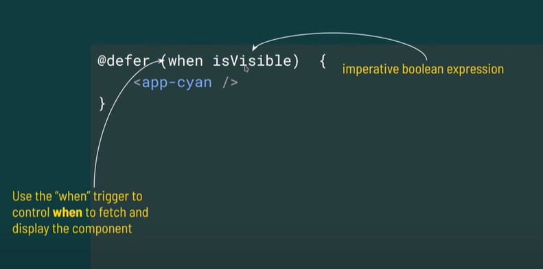

2. placeholder

    without delay:

    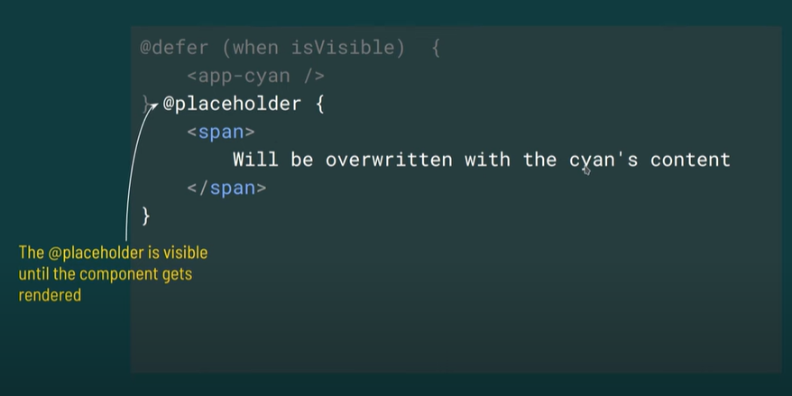
   

    with delay:
    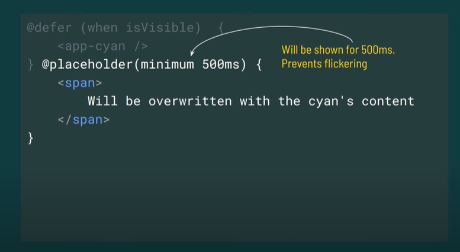

3. Loading Indicator

   Without delay:

   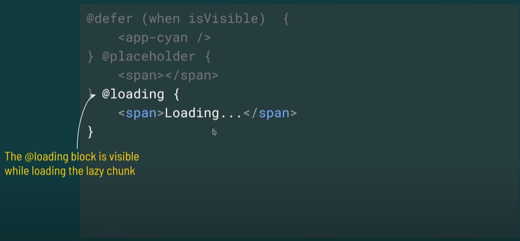

   with delay:

   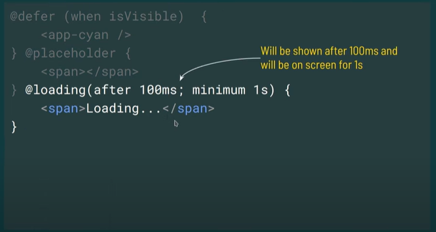

4. Error block
   
   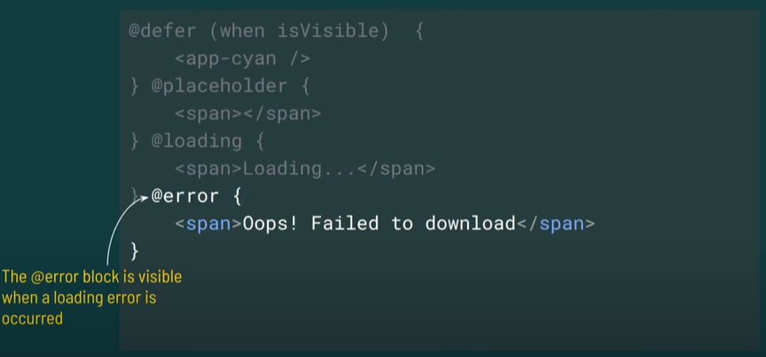

With Triggers:

1. on idle
   
   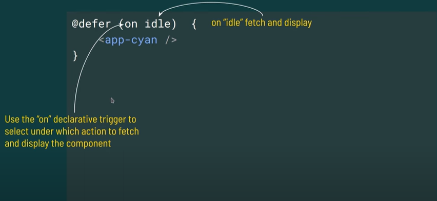

2. on immediate
   
   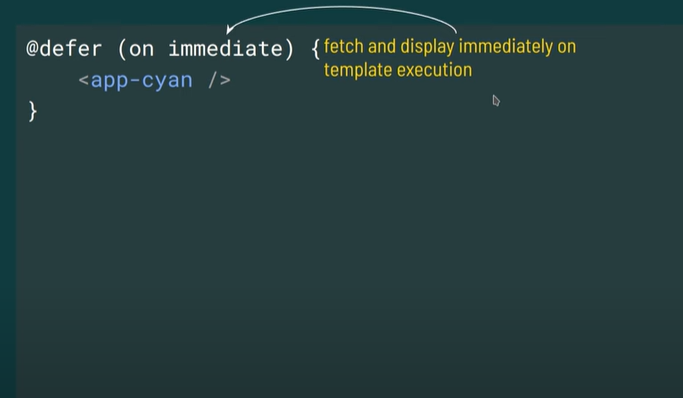

3. on interaction
   
   implicit

   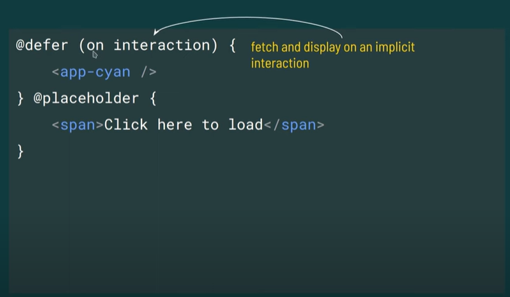

   explicit

   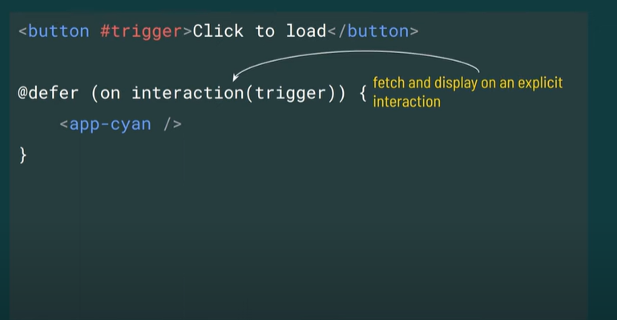

4. on hover
   
   implicit

   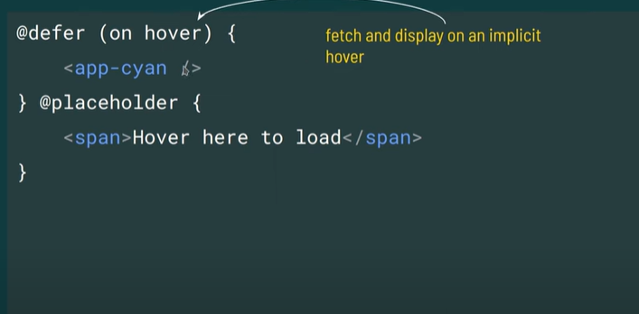

   explicit

   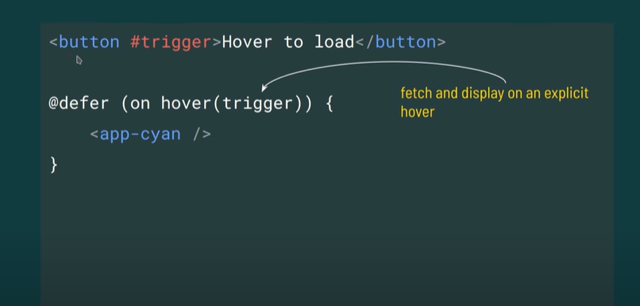

5. on viewport
   
   implicit

   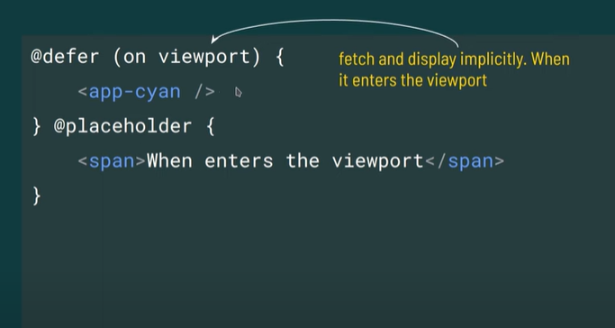

   explicit

   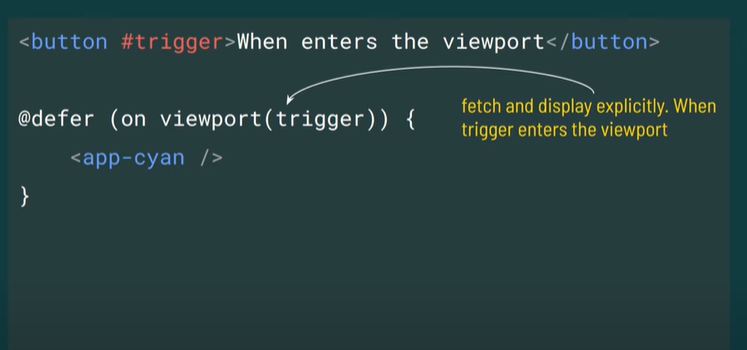

6. on timer

    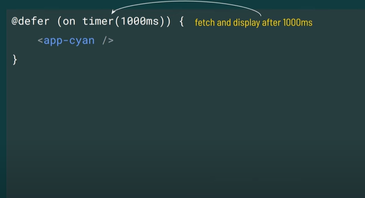