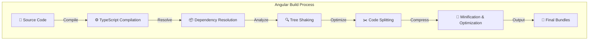
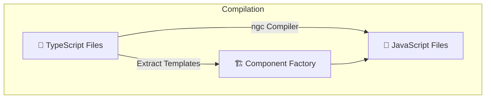
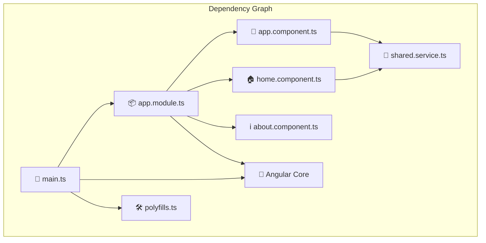
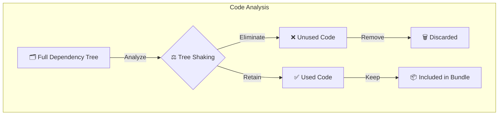
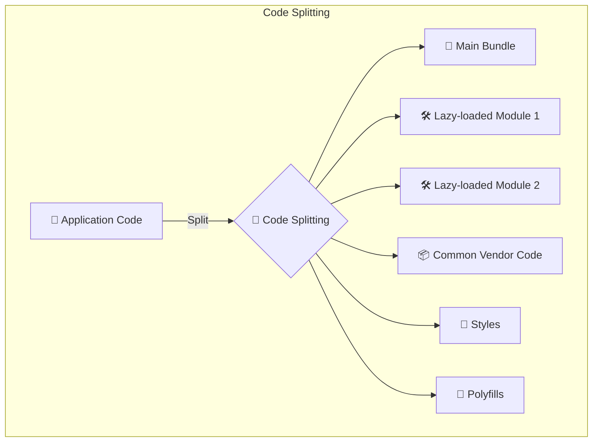
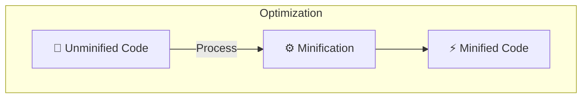
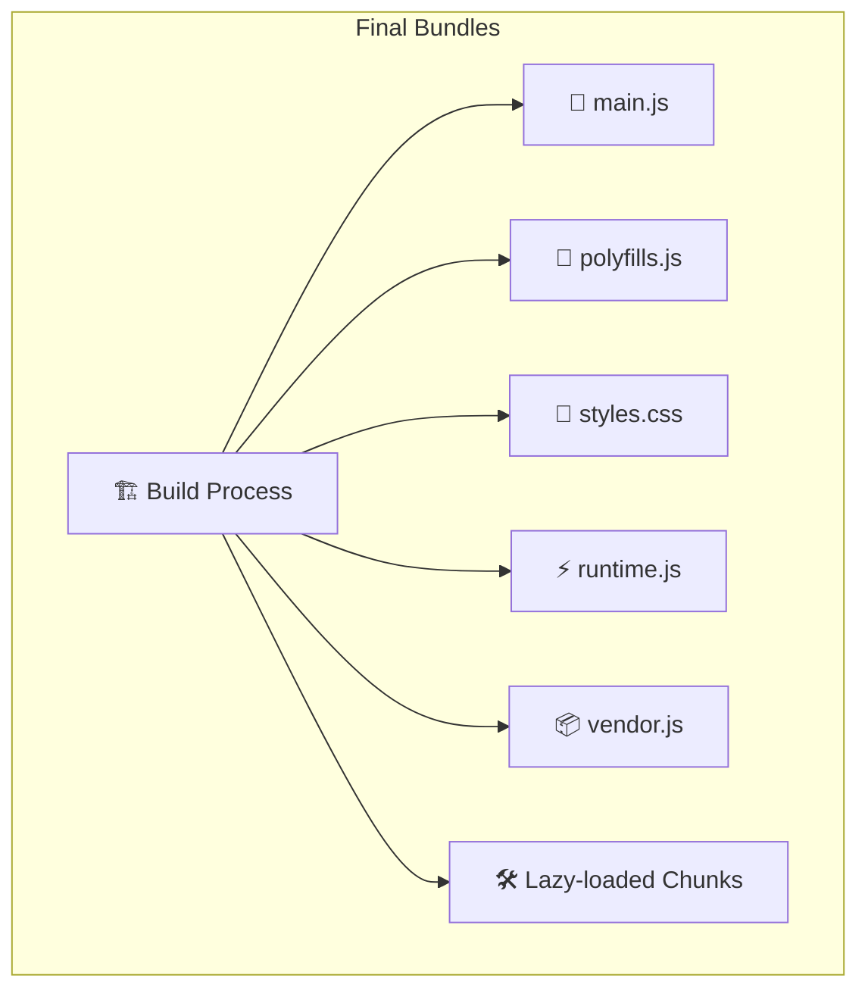
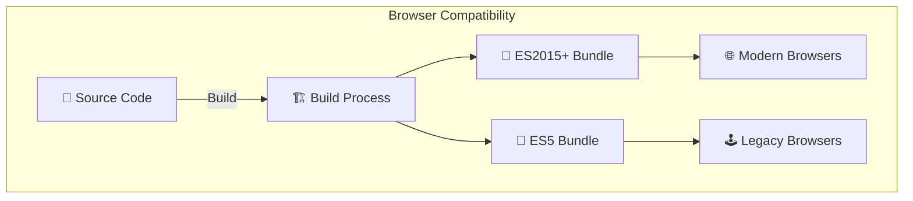
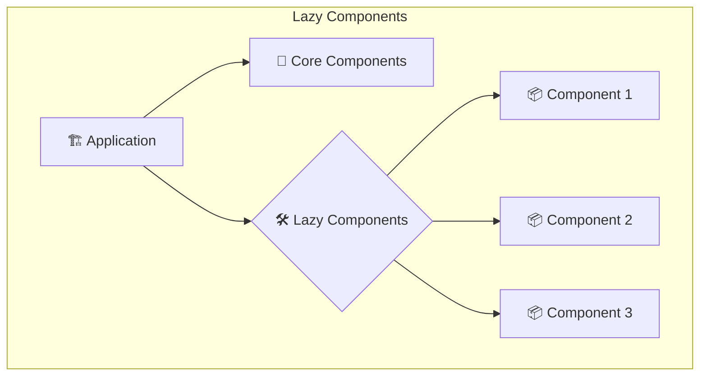

# Angular Bundling Process Guide

## Overview

Angular applications are built into a set of optimized files that browsers can download and execute efficiently. This document explains how Angular transforms your source code into the final bundles.



## Key Phases of the Angular Bundling Process

### 1. TypeScript Compilation

Angular first compiles your TypeScript code into JavaScript that browsers can understand.



### 2. Dependency Resolution

The build system analyzes import statements to create a complete dependency graph of your application.



### 3. Tree Shaking

The build process removes unused code to reduce bundle size.



### 4. Code Splitting

Angular divides your application into logical chunks for more efficient loading.



### 5. Minification & Optimization

The build process compresses code by removing whitespace, shortening variable names, and applying various optimizations.



### 6. Final Bundle Generation

The build process outputs the final optimized files as seen in your screenshot.



## Bundle File Purposes

| File | Purpose | Example Size |
|------|---------|--------------|
| main.js | Your application code | 68.97 kB |
| polyfills.js | Browser compatibility code | 90.20 kB |
| styles.css | Global styles | 97.55 kB |
| runtime.js | Webpack runtime (not shown in screenshot) | ~2-3 kB |
| vendor.js | Third-party libraries (not shown in screenshot) | ~200-500 kB |
| chunk-*.js | Lazy-loaded features | Varies |

## Controlling the Bundling Process

You can customize bundling using the Angular CLI configuration (`angular.json`):

```json
"configurations": {
  "production": {
    "optimization": true,
    "outputHashing": "all",
    "sourceMap": false,
    "namedChunks": false,
    "extractLicenses": true,
    "vendorChunk": true,
    "buildOptimizer": true,
    "budgets": [
      {
        "type": "initial",
        "maximumWarning": "2mb",
        "maximumError": "5mb"
      }
    ]
  }
}
```

## Advanced Bundling Techniques

### Differential Loading

Angular can generate multiple bundles targeting different browser capabilities:



### Component-Level Code Splitting

With Ivy, Angular can split code at the component level:



## Analyzing Bundle Size

Use the `source-map-explorer` or `webpack-bundle-analyzer` to visualize your bundle composition:

```bash
ng build --prod --source-map
npx source-map-explorer dist/my-app/*.js
```

This produces a visualization showing what code is taking up space in your bundles.

## Summary

The Angular bundling process transforms your source code into optimized bundles that enable efficient delivery to browsers. Understanding this process helps you create leaner, faster applications that provide better user experiences.
Yes! Since you are already experienced in Angular development, I’ll give you an **expert-level breakdown** of the Angular bundling process with real-world examples.  

---

## **🔹 Angular Bundling Process Explained**
When you build an Angular application, the framework transforms your TypeScript, HTML, and CSS into highly optimized JavaScript bundles that can be loaded in the browser efficiently.

The bundling process consists of several key steps:  

### **1️⃣ TypeScript Compilation (TS → JS)**
Angular compiles TypeScript (`.ts`) files into JavaScript (`.js`) using the Angular Compiler (`ngc`).  
Example:  
```typescript
// Before Compilation (TypeScript)
export class ExampleComponent {
  title: string = 'Angular Bundling';
}
```
After compilation:
```javascript
// After Compilation (JavaScript)
export class ExampleComponent {
  constructor() {
    this.title = 'Angular Bundling';
  }
}
```
📌 **Key Optimizations:**  
- Ahead-of-Time (AOT) Compilation  
- Angular Ivy Renderer  

---

### **2️⃣ Dependency Resolution (Creating a Dependency Graph)**
The build system analyzes all the `import` statements and constructs a **dependency graph**.

📌 **Example:**
```typescript
// app.module.ts
import { NgModule } from '@angular/core';
import { BrowserModule } from '@angular/platform-browser';
import { AppComponent } from './app.component';

@NgModule({
  declarations: [AppComponent],
  imports: [BrowserModule],
  bootstrap: [AppComponent]
})
export class AppModule {}
```
**How it works:**  
- The build system detects imports in `app.module.ts` and resolves them.  
- Unused dependencies are identified for **tree shaking** (next step).  

---

### **3️⃣ Tree Shaking (Removing Unused Code)**
Tree shaking eliminates **dead code** from your final bundle.  

📌 **Example:**  
```typescript
// Importing unnecessary modules
import { Component, Injectable, EventEmitter } from '@angular/core';

@Component({
  selector: 'app-home',
  template: '<h1>Home</h1>'
})
export class HomeComponent {}
```
✅ After tree shaking, only `Component` is kept because `Injectable` and `EventEmitter` are unused.  

📌 **Tools Used:**  
- **Terser (UglifyJS successor)** for minification  
- **ESBuild/Rollup/Webpack** for bundling  

---

### **4️⃣ Code Splitting (Lazy Loading & Chunking)**
Angular splits your app into **smaller chunks** for better performance.  

📌 **Example (Lazy Loading a Module)**
```typescript
const routes: Routes = [
  { path: '', component: HomeComponent },
  {
    path: 'admin',
    loadChildren: () => import('./admin/admin.module').then(m => m.AdminModule)
  }
];
```
🔹 **What Happens?**  
- `admin.module.ts` is bundled into `admin.chunk.js`  
- It is only loaded when the user navigates to `admin`  

**Result:**  
- **Smaller initial bundle**
- **Faster page load times**

---

### **5️⃣ Minification & Optimization**
Minification reduces the final bundle size by:  
✅ Removing **whitespace & comments**  
✅ Shortening **variable names**  
✅ Removing **console logs**  

📌 **Example (Before Minification):**  
```javascript
function calculateTotal(items) {
  let sum = 0;
  for (let i = 0; i < items.length; i++) {
    sum += items[i].price;
  }
  return sum;
}
```
📌 **After Minification:**  
```javascript
function c(t){let s=0;for(let i=0;i<t.length;i++)s+=t[i].p;return s}
```
📌 **Tools Used:**  
- **Terser** for JavaScript  
- **PostCSS/CSSNano** for CSS  

---

### **6️⃣ Final Bundle Generation**
After optimization, Angular generates multiple bundles:

| **File**       | **Purpose**                           | **Example Size**  |
|---------------|-------------------------------------|----------------|
| `main.js`     | Application logic                  | ~50KB         |
| `vendor.js`   | Third-party libraries (RxJS, Angular Core) | ~200-500KB    |
| `polyfills.js`| Legacy browser support            | ~100KB        |
| `styles.css`  | Global styles                      | ~90KB         |
| `runtime.js`  | Webpack runtime loader            | ~3KB          |

---

## **🔹 Advanced Bundling Techniques**
### **1️⃣ Differential Loading (Modern vs. Legacy Browsers)**
Angular generates **two bundles**:  
1. **ES2015+** (Modern browsers) → Smaller, faster  
2. **ES5** (Old browsers like IE11) → Larger, backward-compatible  

📌 **Configuring `angular.json` for Differential Loading:**  
```json
"browserslist": [
  "defaults",
  "not IE 11"
]
```

---

### **2️⃣ Webpack Bundle Analysis**
To analyze bundle size:  
```bash
ng build --prod --source-map
npx source-map-explorer dist/my-app/*.js
```
🔍 **Identifies:**  
- Large dependencies  
- Code duplication  

---

## **🔹 Summary**
✅ **TypeScript Compilation:** Converts TS to JS  
✅ **Dependency Resolution:** Builds import graph  
✅ **Tree Shaking:** Removes unused code  
✅ **Code Splitting:** Creates smaller bundles  
✅ **Minification & Optimization:** Reduces size  
✅ **Final Bundles:** Generates `main.js`, `vendor.js`, etc.  

💡 **By understanding Angular's bundling process, you can improve your app’s performance!** 🚀  

---

 