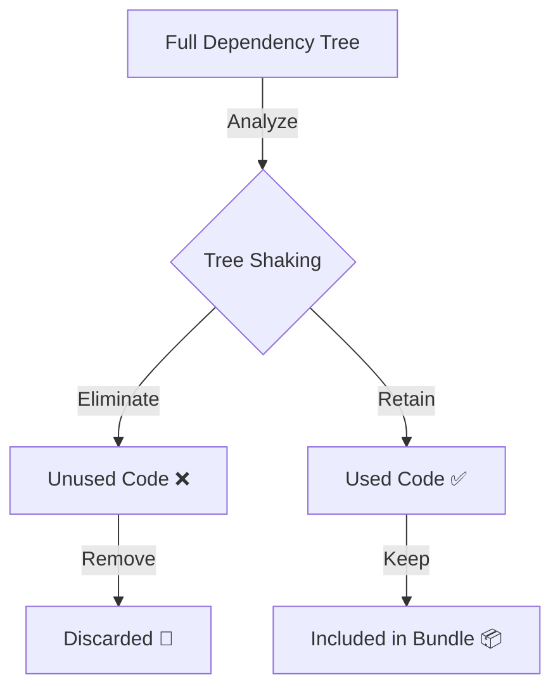
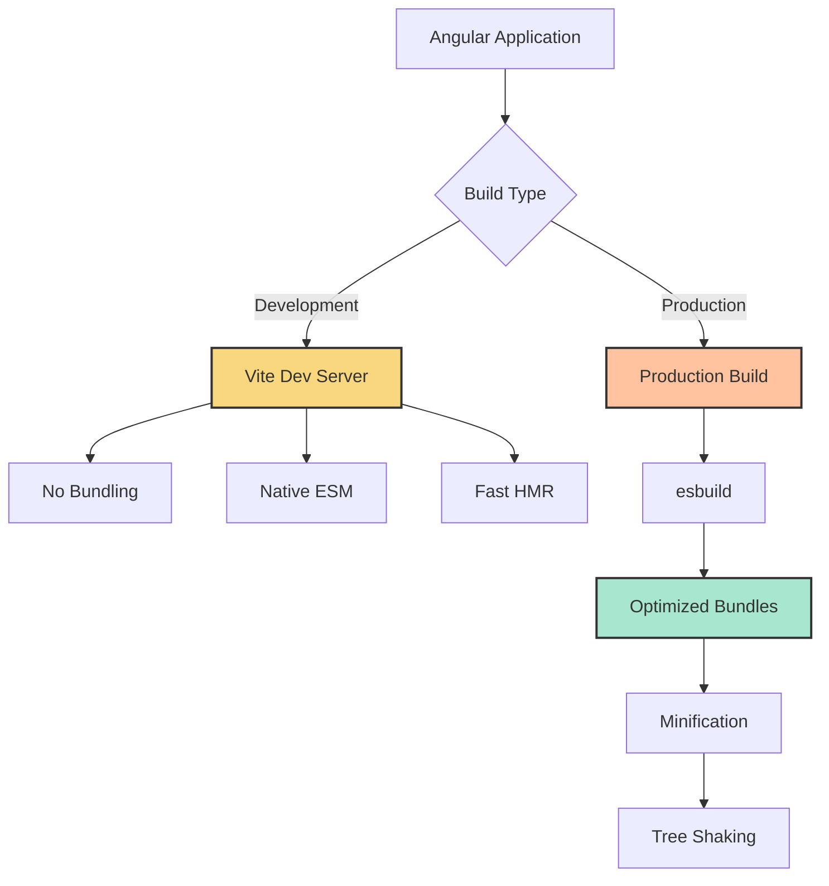
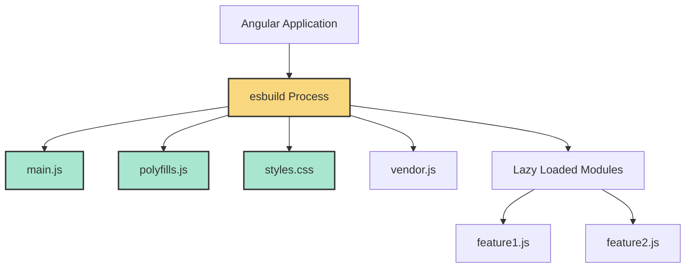
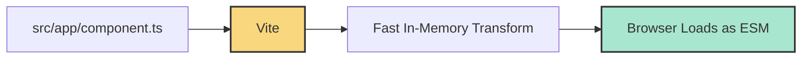
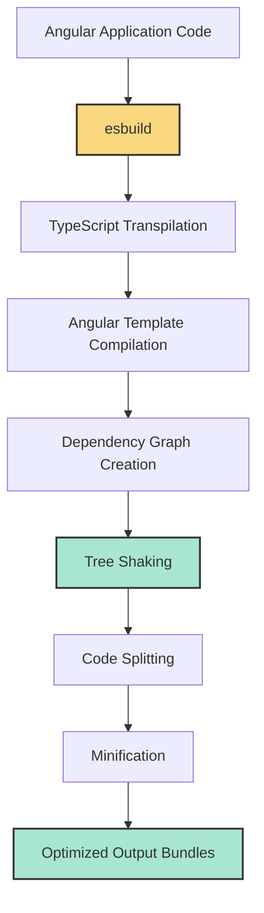
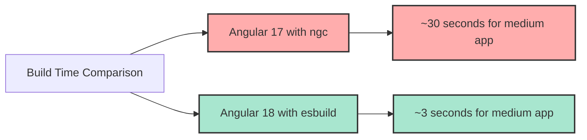

# Angular 18 Bundling Process

## Overview of Changes in Angular 18

Angular 18 introduced significant changes to the build system, moving away from the legacy ngc compiler to a more modern build pipeline based on Vite and esbuild. This document explains the current bundling process and key differences from previous versions.

## The Modern Angular 18 Build Pipeline



## Key Changes in Angular 18

### 1. Compiler Replacement: Goodbye ngc

Angular 18 has deprecated the Angular-specific compiler (`ngc`) in favor of using `esbuild` with Angular-specific plugins. This change has several benefits:

- **Build Speed**: Significantly faster compilation times (10-20x in some cases)
- **Simplified Process**: More aligned with modern JavaScript ecosystem
- **Better Developer Experience**: Faster hot module replacement (HMR)

### 2. Vite as the Development Server


## Detailed Angular 18 Bundling Process

### 1. Development Build vs Production Build



### 2. Angular 18 Bundle Generation



## Angular 18 Bundle Output

Terminal output from an Angular 18 build might look like:

```
vite v5.0.0 building for production...
✓ 253 modules transformed.
dist/my-app/index.html                  0.51 kB │ gzip:  0.33 kB
dist/my-app/assets/index-a4a25eb9.css   8.03 kB │ gzip:  2.35 kB
dist/my-app/assets/index-c1465a0a.js   175.28 kB │ gzip: 56.89 kB
dist/my-app/assets/polyfills-62721410.js 4.06 kB │ gzip:  2.01 kB
```

## Detailed Technical Explanation

### esbuild Instead of ngc

Angular 18 no longer uses the proprietary `ngc` compiler. Instead, it uses:

1. **esbuild**: For TypeScript compilation and bundling
2. **Angular-specific plugins**: To handle Angular templates and decorators

```typescript
// Example esbuild configuration in angular.json
"architect": {
  "build": {
    "builder": "@angular-devkit/build-angular:browser-esbuild",
    "options": {
      "outputPath": "dist/my-app",
      "index": "src/index.html",
      "main": "src/main.ts",
      // ...
    }
  }
}
```

### Development Mode: Vite-Powered

In development mode:

1. Vite serves individual ES modules directly
2. No bundling occurs during development
3. Only the changed modules are re-processed
4. Browser natively handles the module system



### Production Build Process



## Angular 18 vs Previous Versions: Compiler Differences

| Feature | Angular <17 (ngc) | Angular 18 (esbuild) |
|---------|-------------------|----------------------|
| Compilation Time | Slower | 10-20x Faster |
| Template Processing | AOT Compiler | esbuild Plugin |
| Hot Module Replacement | Limited | Fast, Native ESM |
| Build Output | Bundled JS | Optimized ESM |
| Incremental Builds | Custom Implementation | Native Vite Features |

## Example: Lazy Loading in Angular 18

```typescript
// routes.ts
const routes: Routes = [
  {
    path: 'admin',
    loadComponent: () => import('./admin/admin.component').then(m => m.AdminComponent)
  }
];
```

Resulting bundle structure:

```
dist/
├── assets/
│   ├── index-c1465a0a.js        (main bundle)
│   ├── admin-5a821e4f.js        (lazy-loaded component)
│   ├── polyfills-62721410.js    (polyfills)
│   └── index-a4a25eb9.css       (styles)
├── index.html
```

## Configuring the Angular 18 Build

Angular 18 uses a simplified configuration in `angular.json`:

```json
{
  "projects": {
    "my-app": {
      "architect": {
        "build": {
          "builder": "@angular-devkit/build-angular:application",
          "options": {
            "outputPath": "dist/my-app",
            "index": "src/index.html",
            "browser": "src/main.ts",
            "polyfills": ["zone.js"],
            "tsConfig": "tsconfig.app.json",
            "inlineStyleLanguage": "scss",
            "assets": ["src/favicon.ico", "src/assets"],
            "styles": ["src/styles.scss"],
            "scripts": [],
            "optimization": false,
            "sourceMap": true
          },
          "configurations": {
            "production": {
              "budgets": [
                {
                  "type": "initial",
                  "maximumWarning": "500kb",
                  "maximumError": "1mb"
                }
              ],
              "outputHashing": "all",
              "optimization": true,
              "sourceMap": false
            }
          }
        }
      }
    }
  }
}
```

## Performance Benefits of Angular 18 Build System



The Angular 18 build system delivers significantly better performance, with up to 10x faster builds for most applications.